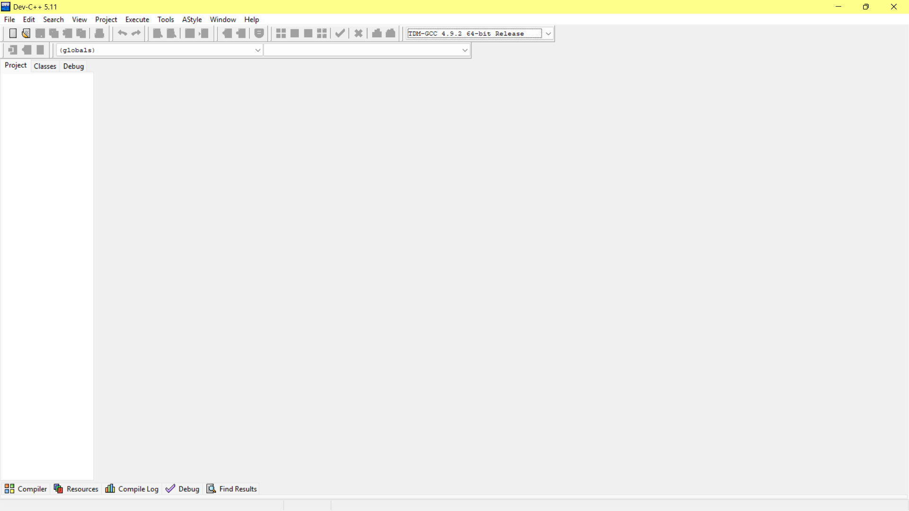
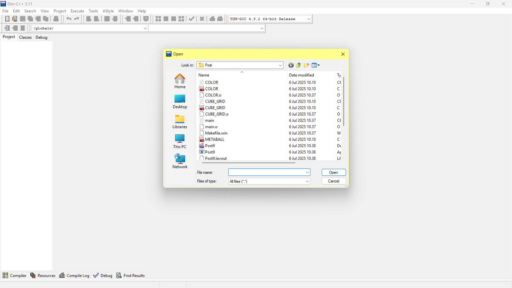
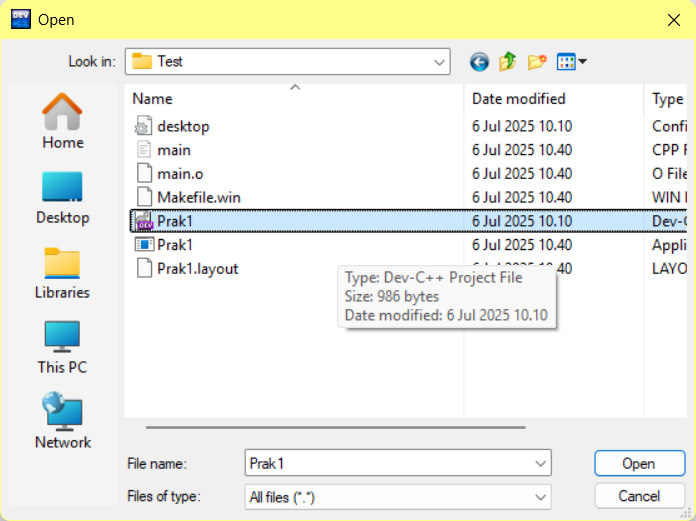
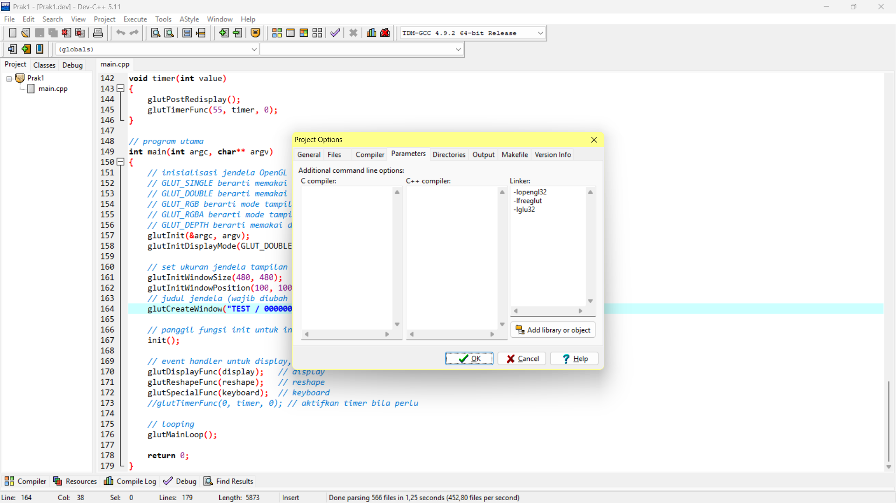
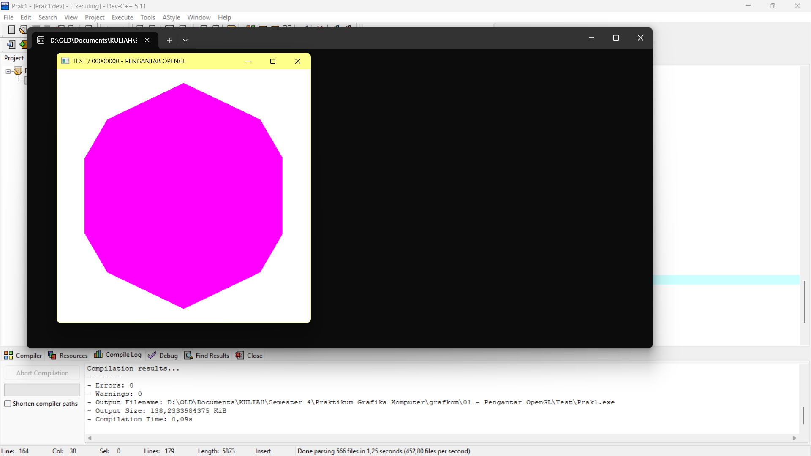

# 📘 How to Access the Project in Dev-C++

Follow these simple steps to open and run the project using **Dev-C++**:

---

### 1. Open Dev-C++ Application

Open your **Dev-C++** application from the Start Menu or Desktop shortcut.

---

### 2. Open the Project Directory

Go to `File` → `Open Project or File`, then navigate to the folder where you saved your project.

---

### 3. Select the `.dev` Project File

Make sure to open the file with the `.dev` extension, as shown in the image below.

---

### 4. Set Project Parameters

Click on `Project` → `Project Options` → `Parameters` tab.

Enter the parameters as shown in the image below.

---

### 5. Run the Project

Once everything is set up, click the **Run** button or press **F10** to build and run your project.

---

> 📝 **Note:** Make sure all necessary files are in the same folder and no compile errors appear.

